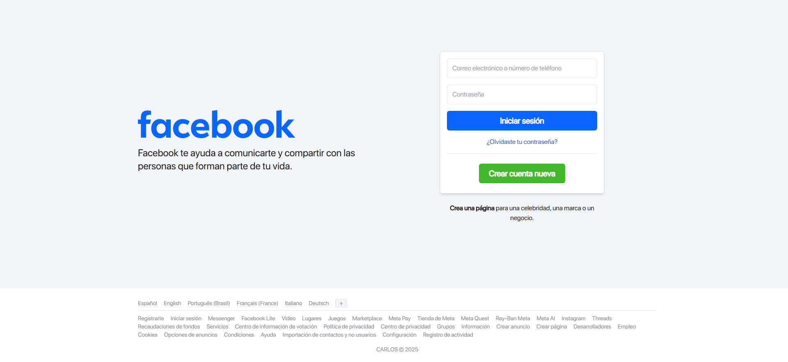
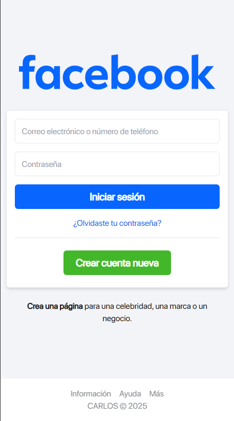

# Clon de la página de inicio de Facebook

Este proyecto es un **clon de la página de inicio de Facebook**, desarrollado con **Next.js**, **React** y **Tailwind CSS**. Fue creado con fines educativos para practicar diseño responsivo y replicar interfaces reales con tecnologías modernas.

- 🔗 **Deploy en Vercel**: https://carlosfacebook.vercel.app/
- 📲 ** Ver demo en YouTube**: https://www.youtube.com/watch?v=ZOVwKn54gm8

---

## 🚀 Tecnologías

- [Next.js](https://nextjs.org/)
- [React](https://react.dev/)
- [Tailwind CSS](https://tailwindcss.com/)
- [TypeScript](https://www.typescriptlang.org/)

---

## 🖥️ Vista previa




---

## 📦 Instalación local

```bash
git clone https://github.com/CarlosDanielOK/facebook-clone.git
cd facebook-clone
npm install
npm run dev
